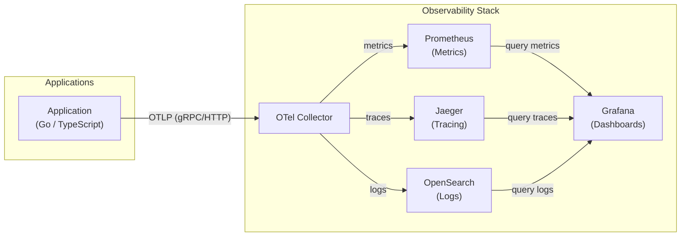

# 🔍 Observability & OpenTelemetry Infrastructure

A comprehensive observability stack built with OpenTelemetry, providing monitoring, tracing, and logging capabilities for modern applications across multiple programming languages.

## 📋 Table of Contents

- [Overview](#overview)
- [Stack Components](#stack-components)
- [Prerequisites](#prerequisites)
- [Quick Start](#quick-start)
- [Examples](#examples)
- [Accessing Services](#accessing-services)
- [Configuration](#configuration)
- [Architecture](#architecture)
- [Development](#development)
- [Troubleshooting](#troubleshooting)
- [Contributing](#contributing)

## 🚀 Overview

This project provides a complete observability infrastructure stack using OpenTelemetry for:

- **Distributed Tracing** with Jaeger
- **Metrics Collection** with Prometheus
- **Data Visualization** with Grafana
- **Log Management** with OpenSearch
- **Telemetry Collection** with OpenTelemetry Collector

The stack is designed to be language-agnostic and includes examples for:
- Go (Golang)
- TypeScript/Node.js

## 🛠 Stack Components

| Component | Version | Purpose | Port |
|-----------|---------|---------|------|
| **Jaeger** | 2.11.0 | Distributed tracing | 16686 |
| **OpenTelemetry Collector** | 0.138.0 | Telemetry data collection | 4317, 4318, 8888, 9999 |
| **Prometheus** | 2.41.0 | Metrics storage & querying | 9090 |
| **Grafana** | 12.2.0 | Metrics visualization & dashboards | 3000 |
| **OpenSearch** | 3.2.0 | Log management & search | 9200 |

All services include Docker health checks with dependency ordering — the OTel Collector waits for Jaeger, Prometheus, and OpenSearch to be healthy before starting.

## 📋 Prerequisites

- Docker Engine 20.10+
- Docker Compose 2.0+
- At least 4GB of available RAM
- Git

## 🚀 Quick Start

1. **Clone the repository**
   ```bash
   git clone https://github.com/filipe1309/o11y-otel-infra.git
   cd o11y-otel-infra
   ```

2. **Start the observability stack** (validates config, starts services, and checks health)
   ```bash
   make quick-start
   ```

   Or start step by step:
   ```bash
   make up       # Start all services
   make health   # Check service health
   ```

3. **Access the web interfaces**
   - Jaeger UI: http://localhost:16686
   - Grafana: http://localhost:3000
   - Prometheus: http://localhost:9090

4. **See all available commands**
   ```bash
   make help
   ```

## 📚 Examples

The repository includes practical examples demonstrating OpenTelemetry integration across different programming languages:

### Go Examples

#### Basic Client-Server
A simple Go client-server application demonstrating basic tracing:

```bash
make example-go-basic
```

**Features:**
- HTTP client/server communication
- Automatic trace propagation
- Custom span attributes
- Structured logging with OpenTelemetry integration
- Request/response logging

### TypeScript Examples

#### Manual Instrumentation
Shows how to manually instrument a TypeScript/Node.js application:

```bash
make example-typescript
```

**Features:**
- Express.js server
- Manual span creation
- Custom instrumentation
- TypeScript configuration

## 🌐 Accessing Services

### Jaeger UI
- **URL**: http://localhost:16686
- **Purpose**: View distributed traces, analyze request flows, and identify performance bottlenecks
- **Features**:
  - Search traces by service, operation, or tags
  - Trace timeline visualization
  - Service dependency graph
  - Performance analysis

### Grafana
- **URL**: http://localhost:3000
- **Credentials**: Anonymous access enabled (no login required)
- **Purpose**: Visualize metrics and create dashboards
- **Pre-configured**: Prometheus datasource at http://prometheus:9090
- **Features**:
  - Real-time metrics dashboards
  - Alert management
  - Custom visualizations

### Prometheus
- **URL**: http://localhost:9090
- **Purpose**: Query and explore metrics data
- **Features**:
  - PromQL query interface
  - Metrics exploration
  - Target monitoring
  - Alert rules

### OpenSearch
- **URL**: http://localhost:9200
- **Purpose**: Search and analyze logs from OpenTelemetry Collector
- **Features**:
  - Full-text search capabilities
  - Log aggregation and indexing
  - REST API access
  - Daily log indices: `otel-logs-yyyy-MM-dd`
  - Integrated with Grafana for log visualization

## ⚙️ Configuration

### OpenTelemetry Collector

The collector is configured in `otel-collector/otelcol-config.yaml` with:

- **Receivers**: OTLP (gRPC/HTTP), Prometheus scraping
- **Processors**: Batch processing, tail sampling (50%), span metrics generation
- **Exporters**: Jaeger, Prometheus Remote Write, OpenSearch (for logs)
- **Connectors**: Span metrics with HTTP dimensions
- **Features**:
  - Tail sampling with 45s decision wait
  - Automatic filtering of health check probes
  - Custom histogram buckets (2ms to 10s)

> [!TIP]
> To send telemetry data to the collector, configure your applications with the environment variable:  
> Local: `OTEL_EXPORTER_OTLP_ENDPOINT=http://localhost:4317`  
> Docker: `OTEL_EXPORTER_OTLP_ENDPOINT=http://otel-collector:4317`

### Prometheus

Configuration in `prometheus/config.yaml`:
- Scrapes OpenTelemetry Collector metrics
- Retention period: 1 hour (configurable)
- Remote write receiver enabled for OTLP ingestion

### Grafana

Pre-configured with:
- **Datasources**:
  - Prometheus (metrics)
  - Jaeger (traces)
  - OpenSearch (logs)
- **Dashboards**: Example dashboard in `grafana/provisioning/dashboards/`
- **Configuration**: Custom settings in `grafana/grafana.ini`
- Anonymous authentication with admin role enabled
- OpenSearch plugin pre-installed

## 🏗 Architecture

<!-- Telemetry data flow from applications through the OTel Collector to storage backends and Grafana -->



## 🔧 Development

### Make Targets

Run `make help` for a full list. Key targets:

| Category | Command | Description |
|----------|---------|-------------|
| Stack | `make up` | Start all services |
| Stack | `make down` | Stop all services |
| Stack | `make restart` | Restart all services |
| Monitoring | `make health` | Check health of all services |
| Monitoring | `make logs-<service>` | Follow logs for a specific service |
| Services | `make jaeger` | Open Jaeger UI in browser |
| Services | `make grafana` | Open Grafana UI in browser |
| Examples | `make example-go-basic` | Run Go client-server example |
| Examples | `make example-typescript` | Run TypeScript example |
| Cleanup | `make clean` | Remove containers and networks |
| Cleanup | `make clean-all` | Remove everything including volumes |
| Dev | `make shell-<service>` | Open shell in a running service |
| Dev | `make inspect-<service>` | Inspect service configuration |
| Config | `make backup-config` | Backup all config files |

### Adding New Examples

1. Create a new directory under `examples/<language>/`
2. Include a `docker-compose.yml` file
3. Add instrumentation code following OpenTelemetry best practices
4. Update this README with your example

### Customizing the Stack

**Configuration Files Structure:**
- `otel-collector/otelcol-config.yaml` - OpenTelemetry Collector configuration
- `prometheus/config.yaml` - Prometheus scrape configs
- `grafana/grafana.ini` - Grafana server settings
- `grafana/provisioning/` - Datasources and dashboards
- `jaeger/config.yml` - Jaeger storage and query configuration

**Customization Options:**
- **Add new exporters**: Modify `otel-collector/otelcol-config.yaml`
- **Configure retention**: Update Prometheus configuration in `prometheus/config.yaml`
- **Add dashboards**: Place JSON files in `grafana/provisioning/dashboards/example/`
- **Custom processors**: Extend the collector configuration with additional processors
- **Adjust sampling**: Modify `tail_sampling` processor in collector config
- **Log indexing**: Configure OpenSearch index patterns in collector exporters

### Environment Variables

Common environment variables for applications:

```bash
# OpenTelemetry
OTEL_EXPORTER_OTLP_ENDPOINT=http://localhost:4317
OTEL_SERVICE_NAME=my-service
OTEL_RESOURCE_ATTRIBUTES=service.version=1.0.0

# Tracing
OTEL_TRACES_EXPORTER=otlp
OTEL_METRICS_EXPORTER=otlp
OTEL_LOGS_EXPORTER=otlp
```

## 🐛 Troubleshooting

### Common Issues

1. **Port conflicts**
   ```bash
   # Check if ports are already in use
   lsof -i :16686 -i :3000 -i :9090 -i :4317
   ```

2. **Memory issues**
   ```bash
   # Increase Docker memory allocation to at least 4GB
   # Check current resource usage
   make ps
   ```

3. **Service connectivity**
   ```bash
   # Check container networking
   make logs-otel-collector
   make logs-jaeger
   make logs-opensearch
   ```

4. **Missing traces**
   - Verify OTLP endpoint configuration
   - Check collector logs for errors
   - Ensure proper instrumentation
   - Note: 50% tail sampling is enabled by default

5. **OpenSearch not healthy**
   ```bash
   # Check OpenSearch status
   make opensearch
   # Check logs
   make logs-opensearch
   ```

### Health Checks

- OpenTelemetry Collector: http://localhost:8888
- Prometheus targets: http://localhost:9090/targets
- OpenSearch cluster: http://localhost:9200/_cluster/health

## 🤝 Contributing

1. Fork the repository
2. Create a feature branch (`git checkout -b feature/amazing-feature`)
3. Commit your changes (`git commit -m 'Add amazing feature'`)
4. Push to the branch (`git push origin feature/amazing-feature`)
5. Open a Pull Request

### Guidelines

- Follow OpenTelemetry best practices
- Include examples for new language integrations
- Update documentation for any configuration changes
- Test your changes with the provided examples

## 📄 License

This project is licensed under the MIT License - see the [LICENSE](LICENSE) file for details.

## 🔗 Useful Links

- [OpenTelemetry Documentation](https://opentelemetry.io/docs/)
- [Jaeger Documentation](https://www.jaegertracing.io/docs/)
- [Prometheus Documentation](https://prometheus.io/docs/)
- [Grafana Documentation](https://grafana.com/docs/)
- [OpenSearch Documentation](https://opensearch.org/docs/)

---

**Happy Observing! 🔍✨**
